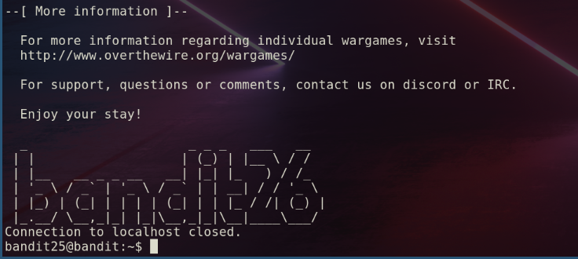
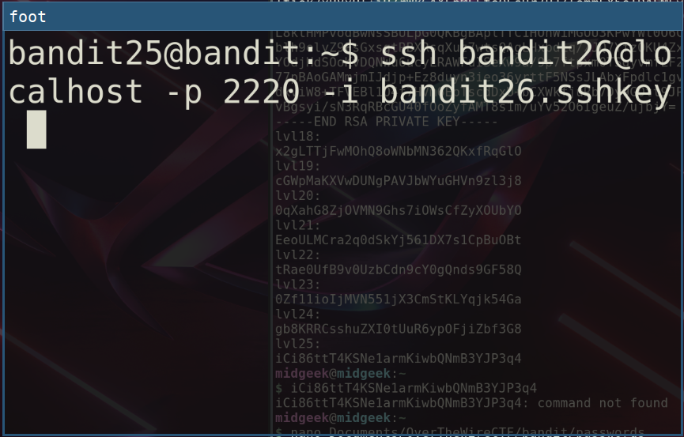
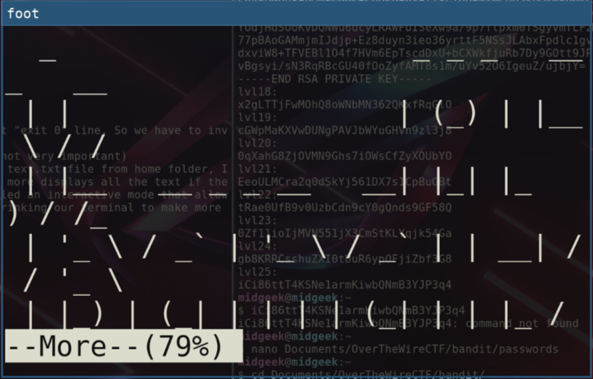
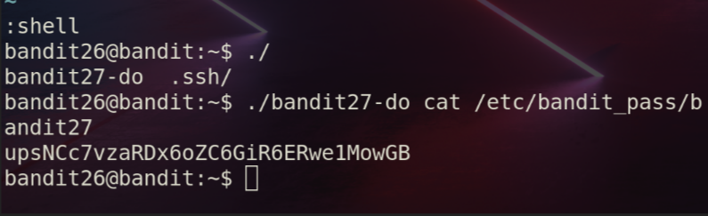
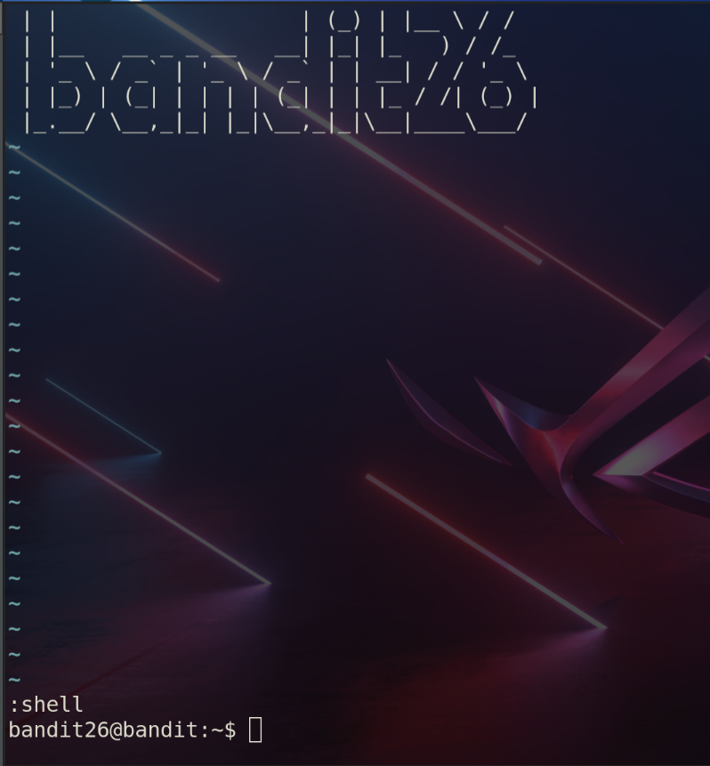
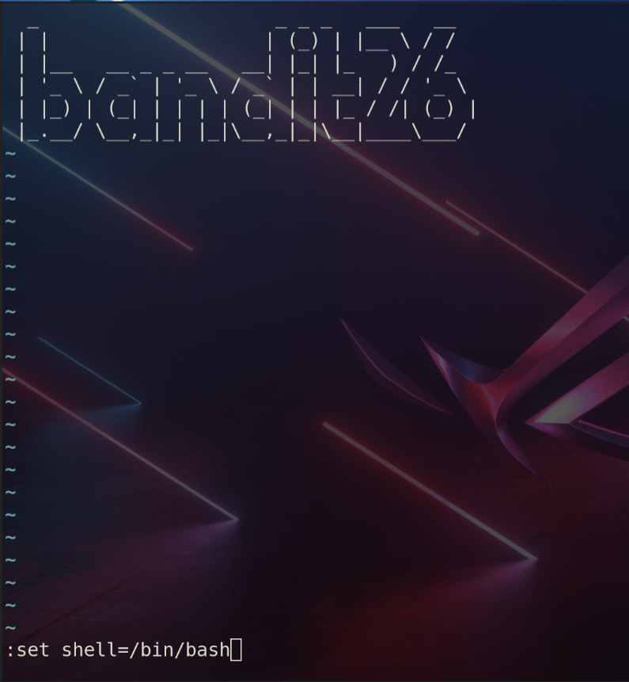

To be honest, this level took me a while to figure out I don't know why, whatever!
after we connected to the machine
```bash
bandit25@bandit:~$ ls
bandit26.sshkey
```
we will find an ssh key for bandit26, using it to connect to bandit26

We are disconnected each time, from the website they say that the login shell si not bash, lets find out what it is
```bash
bandit25@bandit:~$ cat /etc/passwd | grep 26
bandit26:x:11026:11026:bandit level 26:/home/bandit26:/usr/bin/showtext
```
it is a binary called showtext, lets see what it is
```bash
bandit25@bandit:~$ cat /usr/bin/showtext 
#!/bin/sh

export TERM=linux

exec more ~/text.txt
exit 0
```
well, now we knew why we are disconnected each time, due to that "exit 0" line, So we have to investigate what it does before exiting:
It sets an environment variable "TERM" value to linux (I think not very important)
but, the next line is the important one, it uses more to read a text.txt file from home folder, I think that is what displayed when we connect after the banner, more displays all the text if the screen have enough size, if it is not, more enters what is called an interactive mode that allows us to scroll through the text, we have to do that trick by shrinking our terminal to make more enter interactive mode


Done !!, now we can press v to make more open vim editor to edit that text, the cool thing is that we can enter a command to open another file, so we can read the password before we have to disconnect
typing the following line :
```bash
:e /etc/bandit_pass/bandit26
```
Success!!

After this we can open a shell to be able to view th password for next level, vim can deploy a shell by entering command 
```bash
:shell
```
but all what it do is executing the same script agai, so we have to set the shell to bash by enetring the following command first:
```bash
:set shell=/bin/bash
```
after this we can use the bash shell using the command :
```bash
:shell
```


Fnally, we can use the setuid binary to view password for bandit26

